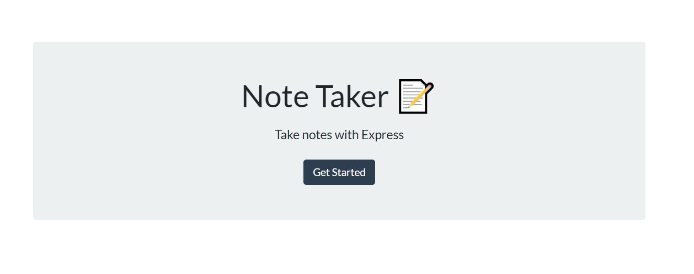
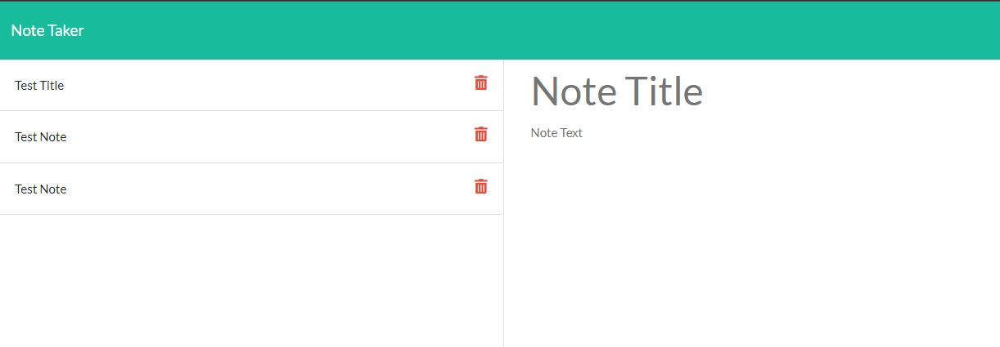

# Note Taker

# Built with
* Express.js
* Node.js
* JavaScript

# Description
A service that you can keep track of notes for personal or business matters.

# Table of Contents
[Description](#description)
[Installation](#installation)
[Screenshots](#screenshots)
[Link](#link)

# Installation
If you would like to install this locally, clone the directory. Then open a terminal in the root of the project folder, run `npm install` and `node server`, and you should be good to go, otherwise you can use the deployed Heroku version listed below.

# Screenshots

# Link
https://desolate-reaches-35174.herokuapp.com/

# Made by
Tyler Sundquist